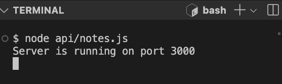
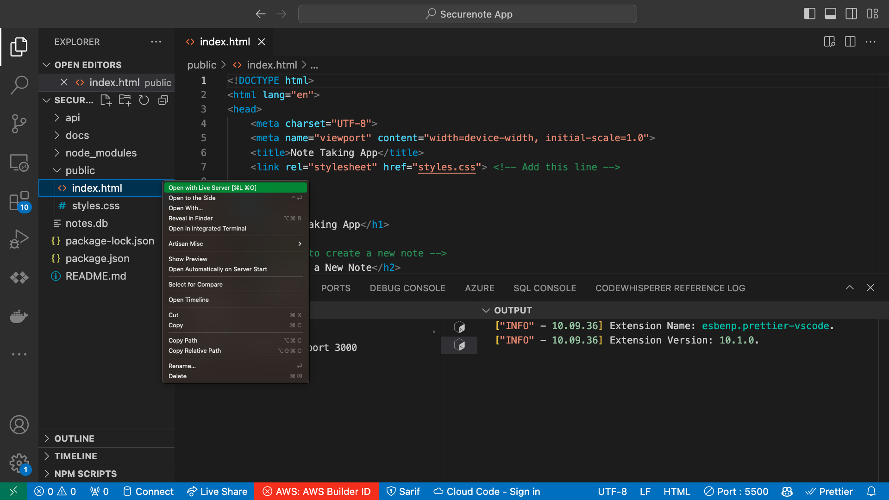
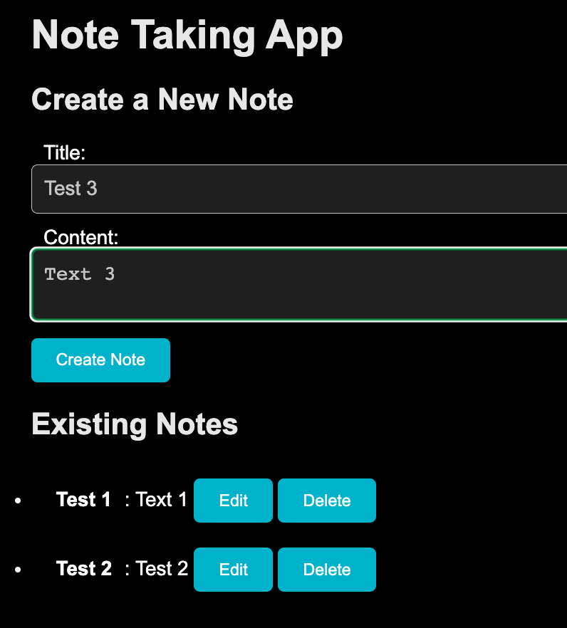

# Securenote.com

En simpel og sårbar notetagningsapplikaton.

Backend i NodeJS/SQLITE og frontend i JS/HTML/CSS. 

Kan debugges i Visual Studio Code. 

## 1. Installer dependencies og start serveren bagefter:

```
npm install 
node api/notes.js
```



## 2. Åben herefter frontenden i Live Server:

```public/index.html```



OBS! Live Server er en extension for [Visual Studio Code](https://marketplace.visualstudio.com/items?itemName=ritwickdey.LiveServer), som kan installeres. Du skal også installere [NodeJS](https://nodejs.org/en/download) på din computer for at kunne køre det. 

## 3. Sådan virker det
Nu kan du bruge notetagnings-applikationen, som ser sådan ud:



